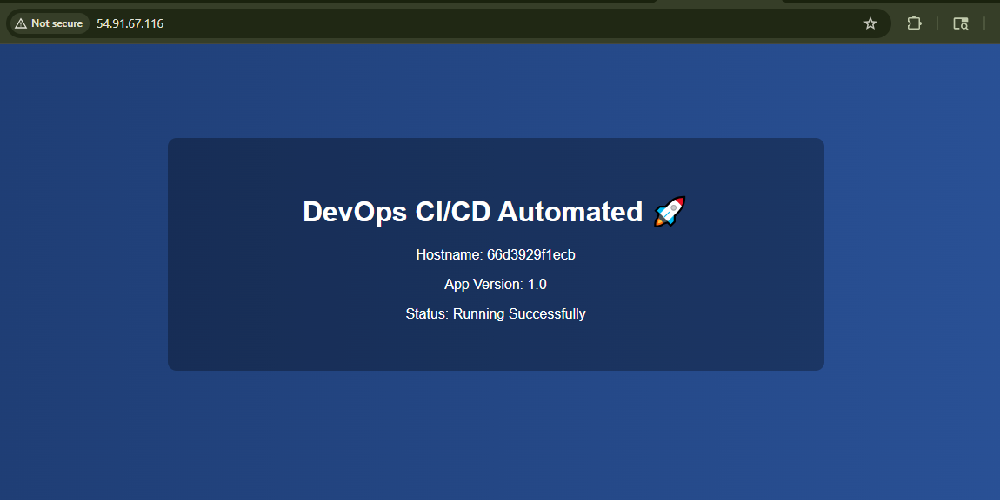
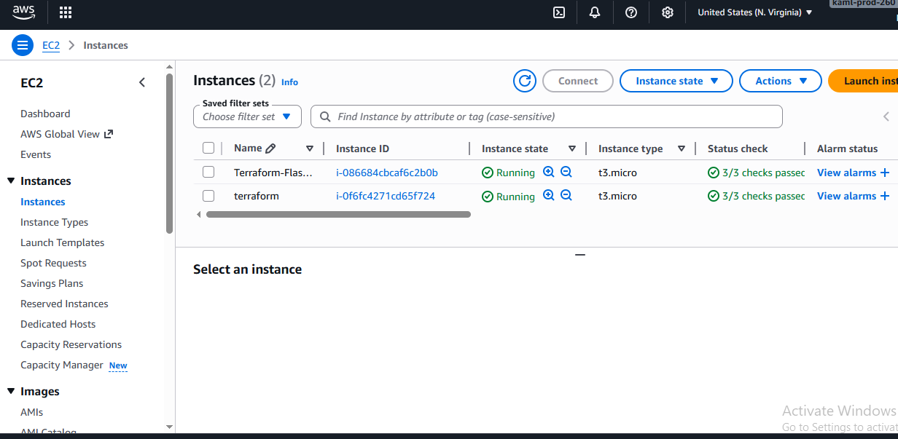
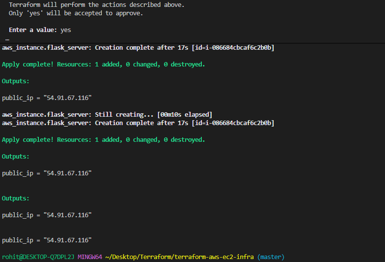

# 🚀 Terraform AWS EC2 Infrastructure Project

## 📌 Overview

This project demonstrates how to provision and deploy a basic web server on AWS using **Infrastructure as Code (IaC)** with Terraform. The setup automatically creates an EC2 instance, configures security groups, and deploys a simple web page accessible via public IP.

Built using:

* Terraform (Infrastructure as Code)
* AWS EC2 (Virtual Server)
* AWS Security Groups
* User Data scripting for automation

---

## 🏗️ Architecture

Terraform provisions the following resources:

* EC2 Instance (Ubuntu / Amazon Linux)
* Security Group (HTTP + SSH access)
* Key Pair (for SSH access)
* User Data script (installs and runs web server)

---

## ⚙️ Prerequisites

Before running this project, ensure you have:

* AWS Account
* AWS CLI installed
* Terraform installed
* IAM user with required permissions (EC2, VPC, IAM)

---

## 🔐 AWS Authentication Setup

Configure AWS credentials:

```bash
aws configure
```

You will need:

* AWS Access Key ID
* AWS Secret Access Key
* Default region (e.g., ap-south-1)
* Output format (json)

---

## 📁 Project Structure

```
terraform-aws-ec2-infra/
│
├── main.tf              # EC2 instance + security group
├── variables.tf         # Input variables
├── outputs.tf           # Output values (public IP)
├── terraform.tfvars     # Variable values (ignored in git)
├── .gitignore           # Ignored files
└── README.md            # Project documentation
```

---

## 🚀 Deployment Steps

### 1. Initialize Terraform

```bash
terraform init
```

### 2. Validate configuration

```bash
terraform validate
```

### 3. Plan infrastructure

```bash
terraform plan
```

### 4. Apply configuration

```bash
terraform apply
```

Type `yes` when prompted.

---

## 🌐 Access Web Server

After successful deployment, Terraform will output a **Public IP**.

Open in browser:

```
http://<public-ip>
```

You should see:

```
Hello from Terraform
```

---

## 🧹 Destroy Infrastructure

To avoid AWS charges:

```bash
terraform destroy
```

---

## 🔒 Security Notes

* `.tfstate` files are excluded from Git
* `.pem` keys are not committed
* IAM credentials should never be hardcoded
* Use least privilege IAM policies

---

## 🎯 DevOps Story (Interview Talking Points)

This project is not just a Terraform demo — it represents a real-world DevOps workflow used in production environments.

### 🧠 Problem Statement

Manually provisioning infrastructure on AWS is slow, error-prone, and not scalable.

### ⚙️ My Solution

I automated the entire provisioning process using Terraform to achieve Infrastructure as Code (IaC).

### 🚀 What This Project Demonstrates

* Infrastructure provisioning without manual AWS console steps
* Reproducible environment using code
* Secure SSH and HTTP access through Security Groups
* Automated web server setup using User Data scripts

### 💡 Real-World DevOps Mapping

| Concept         | Implementation                    |
| --------------- | --------------------------------- |
| IaC             | Terraform configuration files     |
| Compute         | AWS EC2 instance                  |
| Networking      | Security Groups (port 22, 80)     |
| Automation      | User Data script for Apache setup |
| Version Control | Git + GitHub                      |

### 🧩 Interview Explanation (30-sec pitch)

“I used Terraform to automate AWS infrastructure provisioning. It creates an EC2 instance, configures security groups for SSH and HTTP access, and deploys a simple web server automatically using user data. This removes manual setup and makes infrastructure reproducible and scalable.”

---

## 📊 Key Learnings

* Infrastructure as Code with Terraform
* AWS EC2 provisioning
* Security Group configuration
* Automating server setup using user data
* Git best practices for DevOps projects

---


## 📸 Screenshots

Add screenshots of your deployed application below:

### Web Server Output



## EC2 Instances



## Terraform apply output



---

## 👨‍💻 Author

Rohit Bhatt

---

## ⭐ Future Improvements

* Add VPC networking module
* Use S3 remote backend for Terraform state
* Implement Auto Scaling Group
* Add Load Balancer (ALB)
* CI/CD with GitHub Actions
